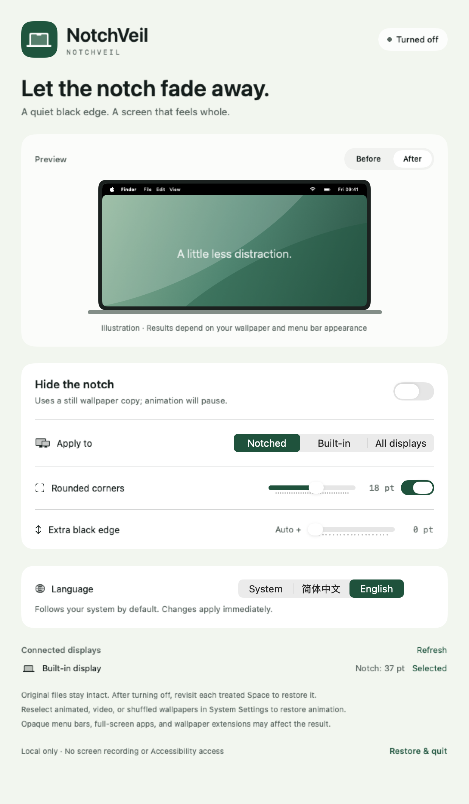

# NotchVeil

English | [中文](README.zh-CN.md)

Hide your MacBook notch with a black wallpaper edge. A native macOS menu bar app with adjustable corners and a bilingual interface.

**macOS 13+ · Apple Silicon · MIT**

[Download](https://github.com/givingwu/NotchVeil/releases) · [User guide](docs/GUIDE.md) · [Release notes](docs/RELEASE-v0.2.0.md)

## Features

- Choose notched, built-in, or all connected displays.
- Adjust black edge height and desktop corner radius.
- Follow your system language by default, or switch between English and Chinese.
- Keep original wallpaper files intact. Runs locally with no extra permissions.

<details>
<summary>Preview</summary>



</details>

## Get started

1. Download `NotchVeil-macOS-arm64.zip` from [Releases](https://github.com/givingwu/NotchVeil/releases).
2. Unzip and move `NotchVeil.app` to **Applications**, then open it.
3. Turn on **Hide the notch**. Open settings from the menu bar to adjust the effect or language.

The current preview build is **not Apple-notarized**. Dynamic wallpapers become still images; after disabling, revisit treated Spaces to restore them. See the [user guide](docs/GUIDE.md) for first-launch help, compatibility, and recovery.

## Build

Requires Apple Command Line Tools with Swift 5.9+.

```sh
bash scripts/build-app.sh
swift run NotchVeilTests
```

The app and installable ZIP are written to `dist/`. [Verification notes](docs/VERIFICATION.md) · [MIT License](LICENSE)
