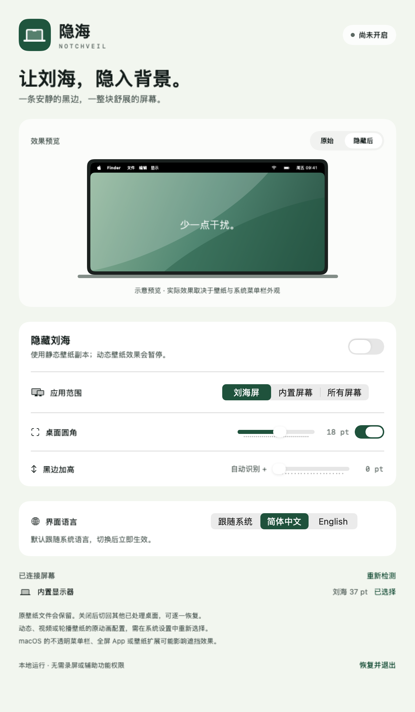

# 隐海 · NotchVeil

[English](README.md) | 中文

用一条黑色壁纸边缘，让 MacBook 刘海融入背景。原生 macOS 菜单栏应用，支持圆角调整和中英双语。

**macOS 13+ · Apple Silicon · MIT**

[下载](https://github.com/givingwu/NotchVeil/releases) · [使用指南](docs/GUIDE.zh-CN.md) · [更新说明](docs/RELEASE-v0.2.0.md)

## 功能

- 选择刘海屏、内置屏幕或所有显示器。
- 调整黑边高度和桌面圆角。
- 默认跟随系统语言，也可手动切换中英文。
- 保留原壁纸文件，本地运行，无需额外权限。

<details>
<summary>界面预览</summary>



</details>

## 快速开始

1. 从 [Releases](https://github.com/givingwu/NotchVeil/releases) 下载 `NotchVeil-macOS-arm64.zip`。
2. 解压，将 `NotchVeil.app` 拖入“应用程序”并打开。
3. 开启“隐藏刘海”，通过菜单栏图标调整效果或界面语言。

当前预览版**未经 Apple 公证**。动态壁纸会转为静态；关闭后需切回各个已处理桌面恢复。首次打开、兼容性和恢复说明见[使用指南](docs/GUIDE.zh-CN.md)。

## 构建

需要 Apple Command Line Tools 和 Swift 5.9+。

```sh
bash scripts/build-app.sh
swift run NotchVeilTests
```

应用与安装包生成在 `dist/`。[验证记录](docs/VERIFICATION.md) · [MIT 许可证](LICENSE)
